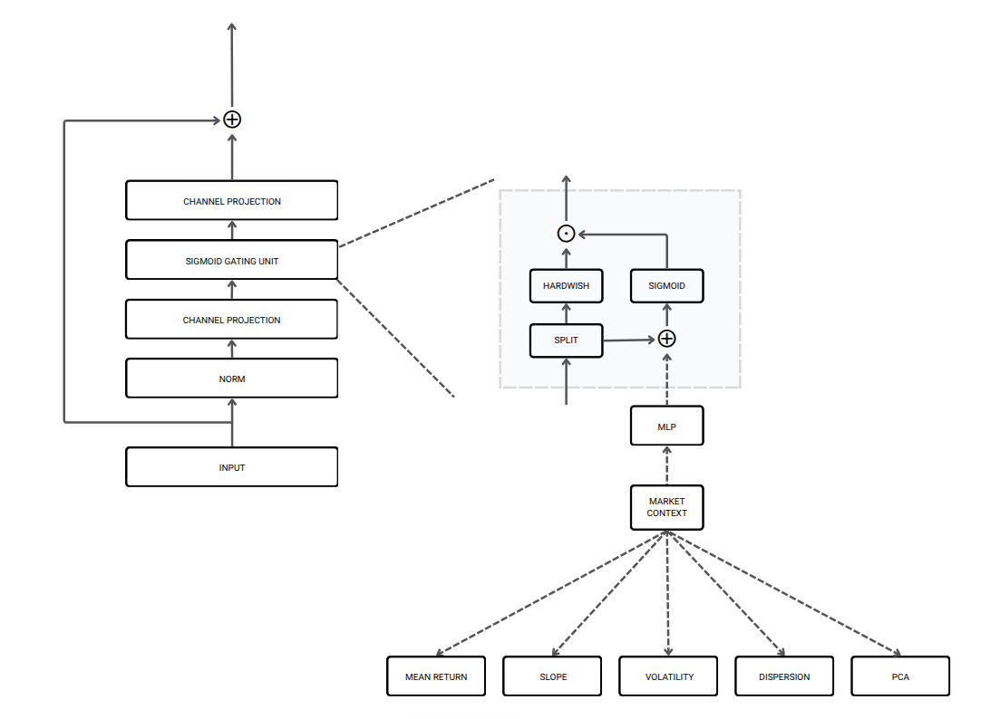

Stock price forecasting requires modeling complex inter-asset relationships across multiple time horizon information,
yet many top performing models such as Transformers with attention or graph neural networks suffer from high
computational costs. To address this, we introduce a novel gated MLP model that helps enhance the ability of
multi-horizon models to better capture inter-stock relationships by injecting window specific market context into the
stock interaction stage. We validate our gMLP module within the lightweight StockMixer framework, which serves as our
experimental testbed. Specifically, we retain StockMixer’s temporal patching of historical data and augment its stock
mixing stage with an internal gating mechanism that leverages precomputed market features to learn rich, latent market
states dynamically. This design captures subtle market dynamics without any attention or graph operations, preserving
architectural simplicity and efficiency. Across multiple benchmark datasets, our gMLP-enhanced model consistently
outperforms existing baselines in predictive accuracy.

