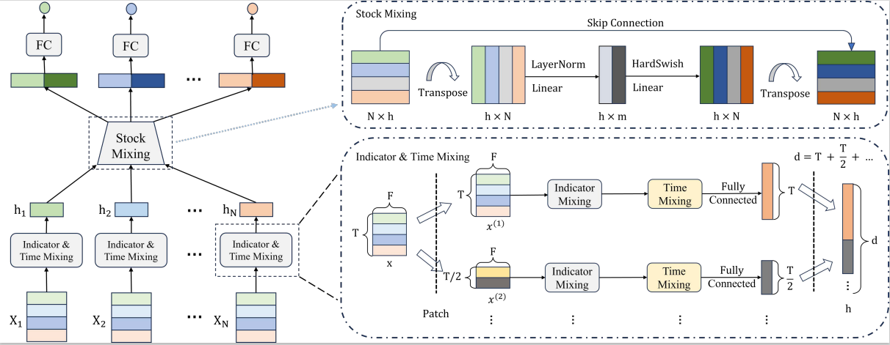
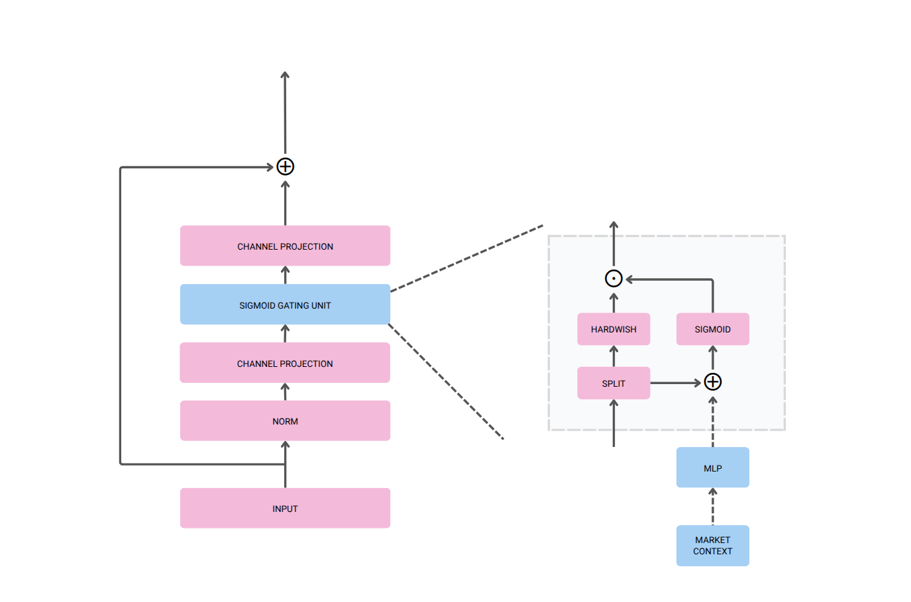
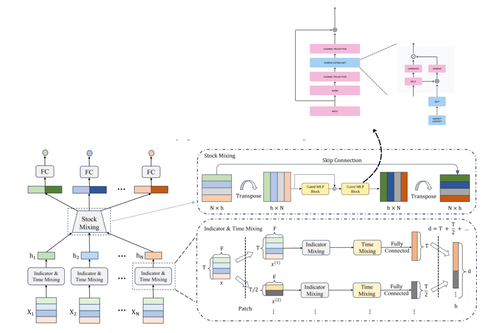

# Stock-Mixer with Gated MLP for Stock Price Forecasting

## Abstract

Stock price forecasting often relies on computationally expensive models like Transformers or GNNs to capture complex market dynamics. This project enhances the **StockMixer** framework, a powerful model for capturing inter-stock relationships, by integrating a novel Gated MLP (gMLP) module.

### Original StockMixer Model

The original StockMixer model provides a strong baseline for modeling stock market data, effectively capturing the relationships between different stocks.

### gMLP Integration

To improve upon the original model, we introduce a lightweight Gated MLP (gMLP) module. This novel component efficiently models inter-stock relationships by injecting market context through a gating mechanism with precomputed market features. This allows the model to learn latent market states without resorting to computationally expensive attention or graph operations.

The integration of the gMLP module into the StockMixer framework results in a model that maintains architectural simplicity and efficiency while consistently outperforming baselines in predictive accuracy across benchmark datasets.

## Datasets

The models were trained and evaluated on three benchmark datasets: NASDAQ, S&P 500, and a cryptocurrency dataset.

| Attribute | NASDAQ | S&P 500 | Crypto |
| :--- | :--- | :--- | :--- |
| Number of Assets | 1,026 | 474 | 117 |
| Start Date | 2013-01-02 | 2016-01-04 | 2015-08-07 |
| End Date | 2017-12-08 | 2022-05-25 | 2018-06-06 |
| Training Days | 756 | 1,006 | 620 |
| Validation Days | 252 | 253 | 207 |
| Test Days | 273 | 352 | 208 |
| Total Days | 1,201 | 1,611 | 1,035 |

## Performance Metrics

The performance of our model is compared against several baselines across the three datasets. The metrics used for evaluation are Information Coefficient (IC), Rank IC (RIC), precision@10 (prec@10), and Sharpe Ratio (SR).

### NASDAQ
| Model | IC | RIC | prec@10 | SR |
| :--- | :--- | :--- | :--- | :--- |
| LSTM | 0.027 | 0.310 | 0.502 | -1.160 |
| GRU | 0.026 | 0.263 | 0.515 | -0.097 |
| Transformer | 0.017 | 0.258 | 0.503 | -0.548 |
| Baseline | 0.033 | 0.393 | 0.531 | 1.440 |
| **Ours** | **0.042** | **0.480** | **0.541** | **1.590** |

### S&P 500
| Model | IC | RIC | prec@10 | SR |
| :--- | :--- | :--- | :--- | :--- |
| LSTM | 0.012 | 0.166 | 0.534 | 2.240 |
| GRU | 0.005 | 0.049 | 0.522 | 1.110 |
| Transformer | 0.022 | 0.233 | 0.527 | 1.600 |
| Baseline | 0.021 | 0.150 | 0.527 | 1.920 |
| **Ours** | **0.039** | **0.279** | **0.540** | **1.650** |

### Crypto
| Model | IC | RIC | prec@10 | SR |
| :--- | :--- | :--- | :--- | :--- |
| LSTM | -0.012 | -0.130 | 0.498 | 4.000 |
| GRU | -0.003 | -0.052 | 0.537 | 1.910 |
| Transformer | 0.005 | 0.068 | 0.514 | 1.730 |
| Baseline | 0.023 | 0.262 | 0.525 | 4.780 |
| **Ours** | **0.028** | **0.291** | **0.516** | **5.640** |

## Tech Stack

- **Python**: The core programming language.
- **PyTorch**: The deep learning framework used to build and train the model.
- **NumPy**: For numerical operations and data manipulation.
- **Pandas**: For data loading and preprocessing.

## Acknowledgments

Parts of this codebase are adapted from [StockMixer](https://github.com/SJTU-DMTai/StockMixer).
